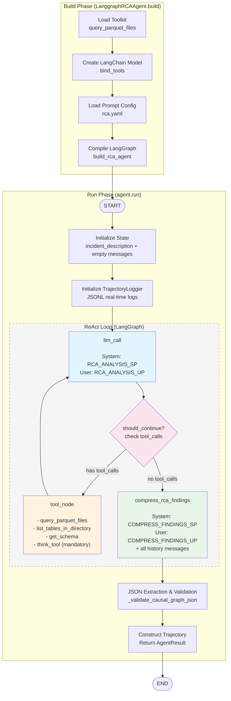

# ThinkDepthAI

# ThinkDepthAI LangGraph RCA Agent Workflow

## Architecture Diagram



---

## State Definition (RCAState)

```python
class RCAState(TypedDict):
    messages: Sequence[BaseMessage]           # conversation history
    tool_call_iterations: int                 # tool call count
    incident_description: str                 # incident description
    rca_findings: str                         # final RCA result
    raw_notes: list[str]                      # raw notes
```

---

## Prompt Examples

### 1. RCA_ANALYSIS_SP (System Prompt - Analysis Phase)

> You are a Root Cause Analysis (RCA) expert conducting systematic investigation of system incidents.
>
> **Your goal is to identify:**
> 1. **Root Cause Service**: Which service is the origin of the failure
> 2. **Fault Propagation Path**: How the error propagated through the system as a causal graph
>
> **Available Data Types:**
> - **Logs**: normal_logs.parquet, abnormal_logs.parquet
> - **Traces**: normal_traces.parquet, abnormal_traces.parquet
> - **Metrics**: normal_metrics.parquet, abnormal_metrics.parquet
>
> **Available Tools:**
> 1. `query_parquet_files` - Query parquet files using SQL
> 2. `list_tables_in_directory` - List all parquet files
> 3. `get_schema` - Get schema information
>
> **CRITICAL: Use `think_tool` after each search to reflect on results and plan next steps**
>
> **Tool Call Budget**: 10-15 typical, **stop after 20**
>
> **Output MUST be CausalGraph JSON** with `nodes`, `edges`, `root_causes`, `component_to_service`

---

### 2. RCA_ANALYSIS_UP (User Prompt - Analysis Phase)

> Please conduct a Root Cause Analysis for the following incident:
>
> ## Incident Description
> `{incident_description}`
>
> ## Your Mission
> Identify:
> 1. **Root Cause Service**: The service where the failure originated
> 2. **Fault Propagation Graph**: The complete causal chain from root cause to all affected services
>
> ## Investigation Strategy
> 1. **Discover Available Data** - `list_tables_in_directory`
> 2. **Understand Data Structure** - `get_schema`
> 3. **Identify Anomalies** - Query abnormal vs normal data
> 4. **Trace Service Dependencies** - Use trace data
> 5. **Determine Root Cause** - Find the earliest abnormal service
> 6. **Map Propagation Path** - Build edges A->B
>
> **Output Format (MUST produce CausalGraph JSON):**
> ```json
> {
>   "nodes": [{"component": "service-name", "state": ["HIGH_ERROR_RATE"], "timestamp": 1234567890}],
>   "edges": [{"source": "root-cause-service", "target": "affected-service"}],
>   "root_causes": [{"component": "root-cause-service", "state": ["HIGH_ERROR_RATE"], "timestamp": 1234567890}],
>   "component_to_service": {}
> }
> ```
>
> **Remember**: Use `think_tool` after each query. Stop when you have enough evidence.

---

### 3. COMPRESS_FINDINGS_SP (System Prompt - Synthesis Phase)

> You are an expert Root Cause Analysis synthesizer.
> Your task is to convert investigation findings into structured CausalGraph JSON format.

---

### 4. COMPRESS_FINDINGS_UP (User Prompt - Synthesis Phase)

> You are an RCA expert who has conducted a thorough investigation of a system incident.
> Your job is now to synthesize all findings into a structured CausalGraph JSON format.
>
> **Task:**
> Transform all investigation findings from tool calls into a structured CausalGraph showing:
> 1. **Root Cause**: Which service(s) initiated the failure
> 2. **Propagation Path**: How the fault spread through the system (as a directed graph)
> 3. **All Affected Services**: Complete list of impacted services
>
> **Tool Call Filtering:**
> - **Include**: All query results showing anomalies, errors, failures
> - **Exclude**: `think_tool` calls (internal reasoning)
> - **Focus on**: Concrete evidence of what went wrong and how it propagated
>
> **Output Requirements:**
> You MUST output ONLY a valid JSON object in the CausalGraph format.
>
> **Critical Rules:**
> - Output **ONLY** the JSON object, no markdown, no explanations
> - `root_causes` field is **MANDATORY**
> - The CausalGraph MUST cover the FULL chain: root cause -> intermediate services -> alert endpoint

---

## Output Example (CausalGraph JSON)

```json
{
  "nodes": [
    {"component": "ts-order-service", "state": ["HIGH_ERROR_RATE"], "timestamp": 1744500000000000000},
    {"component": "ts-payment-service", "state": ["TIMEOUT"], "timestamp": 1744500005000000000},
    {"component": "ts-user-service", "state": ["HIGH_LATENCY"], "timestamp": 1744500010000000000}
  ],
  "edges": [
    {"source": "ts-order-service", "target": "ts-payment-service"},
    {"source": "ts-payment-service", "target": "ts-user-service"}
  ],
  "root_causes": [
    {"component": "ts-order-service", "state": ["HIGH_ERROR_RATE"], "timestamp": 1744500000000000000}
  ],
  "component_to_service": {}
}
```

---

## Key Code Paths

| Component | File Path |
|-----------|-----------|
| Agent Class | `src/thinkdepthai/agent.py` |
| Graph Definition | `src/thinkdepthai/graph.py` |
| State Definition | `src/thinkdepthai/state.py` |
| Prompt Template | `src/thinkdepthai/prompts/agents/langgraph/rca.yaml` |

---

## Evaluation

The agent is scored against [`lincyaw/openrca2-lite-v3`](https://huggingface.co/datasets/lincyaw/openrca2-lite-v3) — 500 curated cases (`ts` / `hs` / `otel-demo`, ~3.8 GB) whose `causal_graph.json` files come from the manifest-driven reasoner shipped in `rcabench-platform >= 0.4.34`. The eval pipeline uses the v2 evaluator (single-tier `(service, fault_kind)` match + DuckDB SQL evidence verification + per-evidence LLM judge).

### One-time setup

```bash
# 1. Install with all extras
uv sync

# 2. Configure LLM creds in .env
cat >> .env <<'EOF'
UTU_LLM_TYPE=chat.completions
UTU_LLM_MODEL=<your-model>
UTU_LLM_BASE_URL=<your-api-base-url>
UTU_LLM_API_KEY=<your-api-key>
EOF

# 3. Pull the dataset (~3.8 GB, 500 cases × ~17 files each)
hf download lincyaw/openrca2-lite-v3 --repo-type dataset \
  --local-dir ./data/openrca2_lite_v3

# 4. Point .env at the snapshot (or pass --root every time)
echo 'OPENRCA2_LITE_V3_ROOT=./data/openrca2_lite_v3' >> .env

# 5. Seed eval rows from manifest.jsonl. Each row's meta.source_data_dir
#    points at <root>/cases/<name>, so no global source_path is needed.
LLM_EVAL_DB_URL=sqlite:///./eval.db \
  uv run python scripts/seed_v3_db.py
```

### Run evaluation

```bash
# Smoke (1 sample) — picks the first case from the v3 tag.
uv run rca llm-eval run config/eval/openrca2_lite_v3_smoke.yaml -a thinkdepthai
```

`config/eval/openrca2_lite_v3_smoke.yaml` reads `LLM_EVAL_DB_URL` from env and filters to rows tagged `openrca2-lite-v3`. To go past 1 sample, edit `max_samples` in the YAML or pass `-l <N>` on the CLI. To launch with the realtime dashboard, add `--dashboard --dashboard-port 8766`.

### Format-only check (no LLM cost)

`scripts/check_preprocess.py <config>` runs the preprocess step against the registered samples — useful for validating that the dataset layout, DB rows, and per-case `meta.source_data_dir` are wired up correctly without spending tokens.

### Local dataset layout (no HF download)

If you already have the v3 dataset on disk (e.g. via a local pool build, or rsync'd from another machine), point `--root` at the directory containing `manifest.jsonl` and `cases/`:

```bash
LLM_EVAL_DB_URL=sqlite:///./eval.db \
  uv run python scripts/seed_v3_db.py --root /path/to/dataset_v3_500_2026-05-03
```

The seeder is idempotent — re-running with `--merge-tags` only adds the v3 tag to existing rows; without it, existing rows are overwritten with the v3 metadata.
